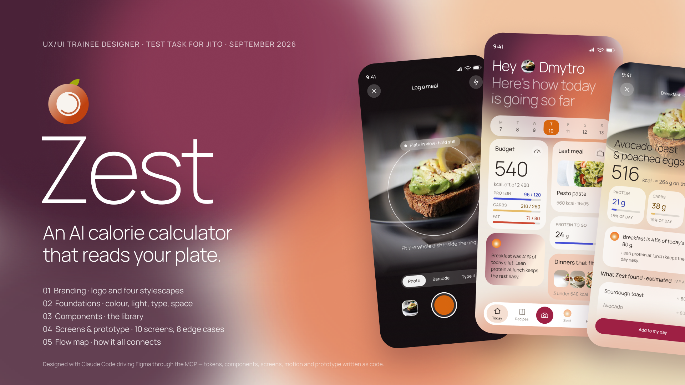
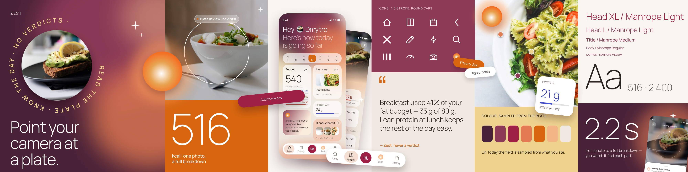

# Zest — AI Calorie Calculator





Test task for the UX/UI Trainee Designer role at Jito.
Brief: [jito-dev/trainee-designer-apr-2026-test-task](https://github.com/jito-dev/trainee-designer-apr-2026-test-task) (branch `develop`).

Everything here was produced with Claude Code driving Figma through the Figma MCP —
tokens, components, screens and prototype links are written as code and created as native
Figma nodes. Nothing was drawn by hand on the canvas.

---

## The product

**Zest** is a nutrition companion. You photograph a plate; it names what is on it, weighs
each part, and tells you what that costs your day — then says what to do next.

Both user stories from the brief are closed end to end:

| Story | Where it happens |
|---|---|
| Calculate the calories in a **dish** | Capture → Analysing → Result |
| Calculate the calories in a **specific product** | Capture → Barcode or Type it → Add a product → portion stepper |
| Find a **recipe suitable for me** | Recipes (ranked by what is left today) → Recipe detail → *Why this fits you* |

---

## The name

The zest is the thin outer layer of a citrus — the part that holds all the flavour. That
is what the product does: it reads the surface (a photograph) and extracts what is inside
it (the macros). The mark is a round fruit with an open arc, and **the arc is the day's
remaining budget**, so the logo shows state rather than only identity.

---

## Visual direction — "Natural light"

The reference points were Milkinside's *Natural OS* work: a screen whose ground is a field
of out-of-focus light rather than a flat colour, translucent tiles with no borders and no
drop shadows, and large type set light.

One idea is ours rather than borrowed: **on Today, the colours of that field are sampled
from what the person actually ate.** The atmosphere is data, not decoration.

### Colour

| Role | Token | Value |
|---|---|---|
| Ground | `ground/porcelain` | `#EFE9E1` |
| Bloom | `bloom/plum` → `bloom/mulberry` → `bloom/ember` → `bloom/amber` | `#4A2238` `#8C3A56` `#E27A52` `#F2B585` |
| Sampled from food | `bloom/butter` | `#EDD28E` |
| **Action** — committing button, nav camera | `action/primary` | `#9E2044` burgundy |
| State (selected, progress, shutter) | `accent/ember` | `#D7650E` |
| Protein · Carbs · Fat | `macro/*` | `#4550D7` `#E6BC6A` `#CE4A34` |
| Opaque surface (nav, inputs) · suggestion tiles | `surface/raised` · `glass/peach` | `#FFFFFF` · `#F4BFA5` 66 % |
| Secondary button | `action/secondary` | ink at 7 % |

**The rule that keeps controls readable:** a control is never the colour of the
atmosphere. The committing action is burgundy on every screen with no exceptions and the
bloom never borrows it; ember is reserved for state and the shutter; red appears only on
destructive actions. Each macro hue also has a `-ink` twin that is safe to set text in,
because the graphic values are too light to carry type.

### Type

**Manrope**, one family, eleven styles. Display sizes run Light so that large numbers stay
calm; `Metric/*` styles carry every figure.

### Layout contract

Every screen obeys the same frame: 390 × 844, 24px side margins, a 342px content column,
status bar at 0, navigation at 59, bottom bar 24 from the edge.

---

## Deliverables

| # | Deliverable | Where |
|---|---|---|
| 1 | Branding / stylescapes | Figma page `01 · Branding` — logo exploration, the main stylescape **Stylescape · Zest** (a dense collage built on one idea: the plate, the lens, the orb and the day are all circles), and four supporting 4000 × 1000 stylescapes: **Where it comes from** (the sources: peel, light, colours sampled from a real plate, photography), **Natural light** (the brand), **The plate is data** (the product), **No verdicts** (the voice). Exports in [`01-branding/`](01-branding/) |
| 2 | Design system | Figma pages `02 · Foundations` and `03 · Components` |
| 3 | Key screens & flows | Figma page `05 · Flow map` ([`03-screens/00-flow-map.png`](03-screens/00-flow-map.png)) and page `04 · Screens & Prototype` — 10 happy-path screens and 8 edge cases, ~60 prototype links, 9 flows (the full journey + one per edge case). Exports in [`03-screens/`](03-screens/) and [`04-edge-cases/`](04-edge-cases/) |

See [`links.md`](links.md) for the Figma link and the video walkthrough; the video script is in [`docs/VIDEO-SCRIPT.md`](docs/VIDEO-SCRIPT.md).

### Screens

Every screen is one of three kinds, and each kind always behaves the same way:

| Kind | Screens | Top-left | Bottom | Arrives by |
|---|---|---|---|---|
| **Place** | Today, Recipes, Zest, History | — | the nav | dissolve, 300 ms |
| **Detail** | Recipe detail | `‹` one step back | one burgundy button | slides in from the right |
| **Flow** | Capture → Analysing → Result, Capture → Add a product | `×` leaves without saving | one burgundy button | rises from the bottom |

```
Welcome ──▶ Capture                     (Scan my first meal)
   └──────▶ Today                       (I already have an account)

Nav, on every place:  Today · Recipes · [ camera ] · Zest · History
                                         └──▶ Capture

Capture ──┬── shutter / library ──▶ Analysing ──(auto)──▶ Result ──▶ Today
          ├── Barcode ────────────▶ Add a product ───────────────────▶ Today
          └── Type it ────────────▶ Add a product

Today ──┬── week strip ───────▶ History
        ├── Zest tile ────────▶ Zest
        └── Dinners that fit ─▶ Recipes ──▶ Recipe detail ──▶ Today
```

The camera in the nav always opens Capture. Every burgundy button commits something and
returns to Today, where it lands. Nothing on a screen duplicates a control that already
lives in the navigation.

### Motion — only where the AI is working

Motion is reserved for one meaning: *the AI is doing something*. Nothing else on screen
moves, so when something does, it is always the assistant.

| Screen | What moves | What it says |
|---|---|---|
| Capture | The lens ring breathes (100 → 106 %), its halo swells a beat later, "Plate in view" rises in | It is looking |
| Analysing | A bead orbits the ring, two turns in 2.2 s; found items surface one by one; the progress bar fills | It is reading, and you can see what it has found so far |
| Ask Zest | The orb breathes; the question, the answer and the next steps arrive in order | It is thinking, then answering |
| Today · Result · Recipe detail | The Zest orb on the insight tile pulses gently | This line was written by the assistant |

Built with Figma Motion keyframes and checked frame by frame from a rendered video.

The edge cases move by the same rule, and the motion says what state the AI is in: the
dashed ring keeps drifting when it can't find a plate, the likelier dish breathes when it
asks, the flash pulses when the fix is light, the sheet rises and then Zest says "Noted"
when a correction is saved. With no connection the orbit stops — only a slow heartbeat on
the bead says it is waiting.

### Edge cases

Eight screens for the moments a happy path never shows — no plate in the photo, two dishes
that look alike, a dark kitchen, no network, an unknown barcode, a day over budget, the
first empty day, a corrected estimate. Each keeps the rules: fact first, no verdicts, one
way forward, nothing lost. See [`04-edge-cases/`](04-edge-cases/).

### Design system

- ~54 Figma variables (colour, spacing, radius) — no hardcoded values in any screen
- 11 text styles
- Components: `Logo` (3 lockups), `StatusBar` (2 tones), `Nav` (4 active states, labelled),
  `Button` (3 kinds × L 46 / M 38), `Chip`, `Badge`, `RoundControl` (back, close, edit, flash)

---

## Tone of voice

Three rules, and they are structural rather than stylistic:

1. **Fact first, opinion second.** The number always precedes the advice.
2. **Address, then offer.** Name the person, state the observation, propose the next step.
   Never issue a verdict.
3. **Food is never bad — distribution is.** Banned: *should, bad, cheat, guilty, failed.*

Rule 3 has a visible consequence: **there is no error red anywhere in the nutrition data.**
Going over a target is stated as a fact in the brand's own clay tone.

> "Breakfast used 41% of your fat budget — 33 g of 80 g.
> Lean protein at lunch keeps the rest of the day easy."

---

## Photography

Nine photographs, all **CC0**, from the Unsplash archive on Wikimedia Commons,
centre-cropped to the ratios the layouts need. Credits — not required by CC0, but given —
are in [`01-branding/PHOTO-CREDITS.md`](01-branding/PHOTO-CREDITS.md).

---

## How this was made

1. Read the brief and the reference stylescapes from the task repository.
2. Agreed the brand platform and the visual direction in conversation.
3. Wrote the tokens, type ramp, components, screens and prototype links as Figma Plugin API
   scripts, executed through the Figma MCP.
4. Verified every step with a rendered screenshot before continuing — several layout bugs
   (collapsed auto-layout heights, a photo fading to a flat band, drifted top bars) were
   found this way rather than by eye at the end.

The direction changed once mid-project, from a light "Sunlit Glass" concept to the current
one. The token architecture absorbed it: changing values in one collection re-coloured
every screen at once.
